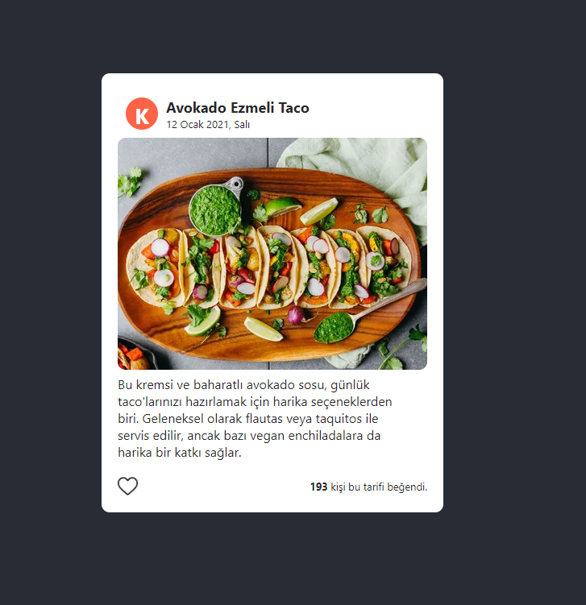

# Recipe Card

Bu projede bir yemek tarifi web sitesindeki her bir yemek için görüntülenecek kartı oluşturuyoruz. Projedeki Card Componenti bir yemek tarifinin detaylarını, yazarını, beğeni sayısını ve kullanıcın tarifi beğenip beğenmediğine dair birtakım bilgileri gösteriyor.

### Proje Nasıl Çalıştırılır

- Projeyi fork'ladıktan ya da indirdikten sonra projenin bulunduğu klasörde "npm install" komutu ile gerekli paketlerin yüklenmesi gerekiyor.
- Daha sonra "npm run start" komutu ile uygulama başlatılabilir.  
---  

